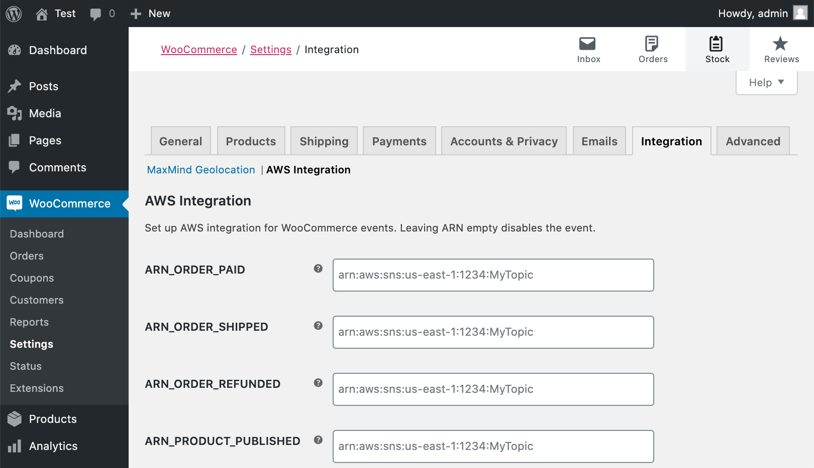

# AWS Integration for WooCommerce

[](https://github.com/Toriverkosto/woocommerce-aws-integration/actions?query=workflow%3ACI)
[](https://github.com/Toriverkosto/woocommerce-aws-integration/releases)
[](https://packagist.org/packages/toriverkosto/woocommerce-aws-integration)
[](https://github.com/anttiviljami/wp-safe-updates/blob/master/LICENSE)

WooCommerce extension to publish events to AWS services from WooCommerce hooks.

You can configure this plugin to publish your WooCommerce business events to any
of the following AWS target resources using their ARN:

- [x] SNS Topic
- [x] SQS Queue
- [x] Kinesis Data Stream
- [x] Firehose Delivery Stream
- [x] S3 Bucket

The following events are currently supported out-of-the-box:

- Order Paid
- Order Shipped
- Order Refunded
- Product Published
- Product Sold
- Product Shipped
- Product Refunded

## Why

This extension unlocks the power of the AWS ecosystem for your WooCommerce
store by pushing your important business events to AWS services.

Some example use cases:

- Send a notification with SNS for new orders
- Run custom Lambda functions for order events
- Query your order data using Athena and S3
- Analyze and visualize your store data using QuickSight
- Create a delivery queue for digital products using SQS
- Synchronize orders and product inventory to backend systems
- Archive your store order history to S3

## Installation

Requirements:

- WooCommerce >= 3.1
- WordPress >= 4.7
- PHP >= 7.1

```
composer require toriverkosto/woocommerce-aws-integration
```

1. Download and install the [latest release](https://github.com/Toriverkosto/woocommerce-aws-integration/releases) of this plugin.

1. Navigate to WooCommerce > Settings > Integration > AWS Integration

1. Input the ARNs for the AWS resources you want to publish events to

1. If running outside of a native AWS environment, you'll also need to configure
   IAM Access keys to be able to access AWS services.



## Configuration

Each of the settings provided by this plugin can also be hard-coded by using
PHP constants matching their label.

Example `wp-config.php`:

```php
define( 'ARN_ORDER_PAID',        'arn:aws:sns:us-east-1:1234:MyTopic' );
define( 'ARN_ORDER_SHIPPED',     'arn:aws:sqs:eu-west-1:1234:MyQueue' );
define( 'ARN_ORDER_REFUNDED',    'arn:aws:firehose:eu-west-1:1234:deliverystream/MyStream' );
define( 'ARN_PRODUCT_PUBLISHED', 'arn:aws:s3:::my-s3-bucket-1234' );

define( 'AWS_ACCESS_KEY_ID',     'XXXX' );
define( 'AWS_SECRET_ACCESS_KEY', 'XXXX' );
define( 'AWS_REGION',            'eu-west-1' );
```

## Development

Requirements:

- PHP 7.1+
- Composer
- Docker

```
composer install
composer run dev
```

To run tests:

```
composer run test
```
